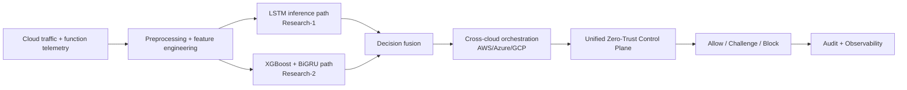
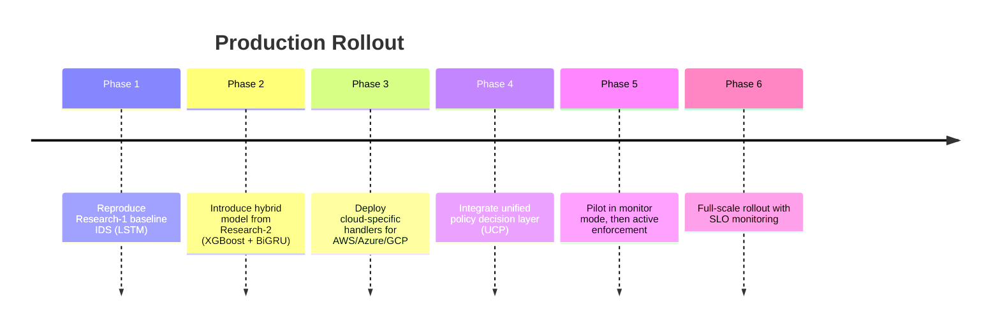

# Implementation Guide: Serverless Intelligent Firewall (Research-1 + Research-2)

## Scope

This document provides a practical path to implement the **Serverless Intelligent Firewall** in real-time environments by combining:

- **Research-1**: LSTM-based serverless IDS baseline
- **Research-2 (SIF-CCA)**: cross-cloud adaptation, hybrid detection, and unified zero-trust policy enforcement

## 1. Combined Target Architecture



## 2. Phased Rollout Plan



## 3. Detailed Implementation Steps

### Step 1: Data Pipeline

- Collect flow-level telemetry and function invocation metadata.
- Normalize schema across cloud providers before model scoring.
- Reuse preprocessing rules from the manuscript:
  - remove duplicates and noisy fields
  - normalize numerical features
  - group attack classes consistently

### Step 2: Model Layer

- Deploy Research-1 LSTM as baseline inference service.
- Deploy Research-2 hybrid path (XGBoost + BiGRU).
- Start with **shadow mode**:
  - baseline model decisions active
  - hybrid decisions logged only
- Compare drift and confidence before enabling hybrid active mode.

### Step 3: Decision and Response Logic

- Define unified decision payload:
  - class label
  - confidence
  - risk score
  - policy context
- Implement deterministic response mapping:
  - `ALLOW` for low-risk benign traffic
  - `CHALLENGE` for uncertain or identity-abuse signals
  - `BLOCK` for high-confidence malicious patterns

### Step 4: Cross-Cloud Orchestration

- Use event buses and serverless triggers per provider.
- Maintain one normalized event contract for all clouds.
- Build idempotent responders so repeated events are safe.

### Step 5: Zero-Trust Control Plane

- Use policy-as-code for enforcement rules.
- Evaluate every request with identity + context + policy.
- Record propagation and decision latency for SLO checks.

## 4. Reference Pseudocode

```python
def process_event(event):
    features = preprocess(event)

    # Research-1 baseline path
    baseline = lstm_predict(features)

    # Research-2 hybrid path
    hybrid = hybrid_predict(features)  # XGBoost + BiGRU fusion

    final_pred = reconcile(baseline, hybrid)
    context = build_zero_trust_context(event, final_pred)
    decision = policy_decision_point(context)

    if decision in {"BLOCK", "CHALLENGE"}:
        dispatch_cloud_action(event.provider, decision, event)

    persist_audit(event, baseline, hybrid, final_pred, decision)
    return decision
```

## 5. Operational SLO Recommendations

- Detection response latency (average): target near reported `135 ms`
- Policy propagation delay: keep near `88-100 ms`
- Identity verification latency: keep near `100-120 ms`
- Policy consistency across providers: target near `99%+`

## 6. Validation Checklist

- Unit tests for preprocessors, policy evaluators, and response mappers.
- Replay tests using labeled historical traces.
- Adversarial tests:
  - burst traffic / DDoS
  - credential abuse
  - cross-cloud policy drift
- Chaos tests for queue lag, function cold starts, and control-plane outages.

## 7. Documentation Cross-links

- Research-1 portal: <https://anis151993.github.io/Serverless-Intelligent-Firewall-Research-1/>
- Research-2 portal: <https://anis151993.github.io/Serverless-Intelligent-Firewall-Research-2/>
- Combined implementation (web): [`docs/implementation.html`](docs/implementation.html)
- Extended report: [`docs/report.html`](docs/report.html)

## 8. Security and Artifact Access

- Full manuscript and source files are distributed as encrypted archives.
- Access is controlled through the website policy gate:
  - GitHub follow
  - YouTube subscription
  - password request via email
  - password entry to unlock links

