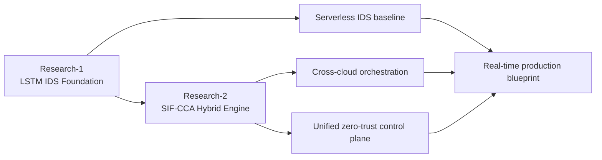
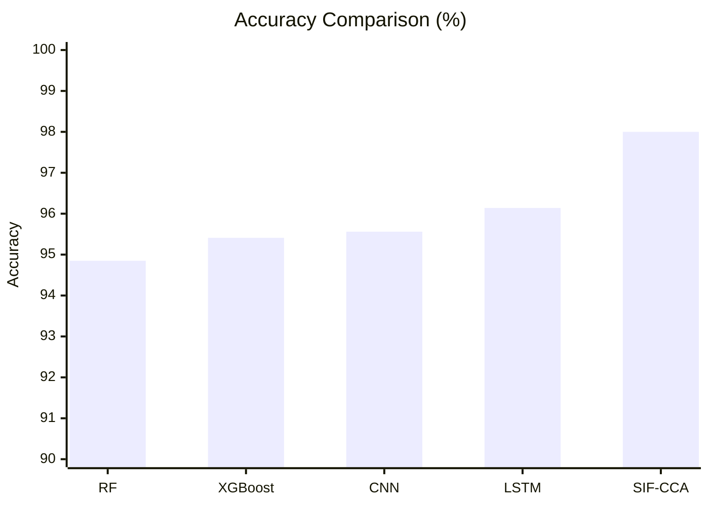
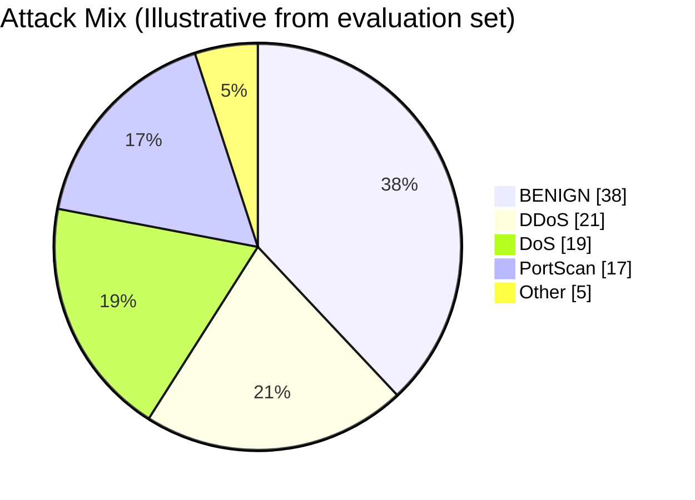
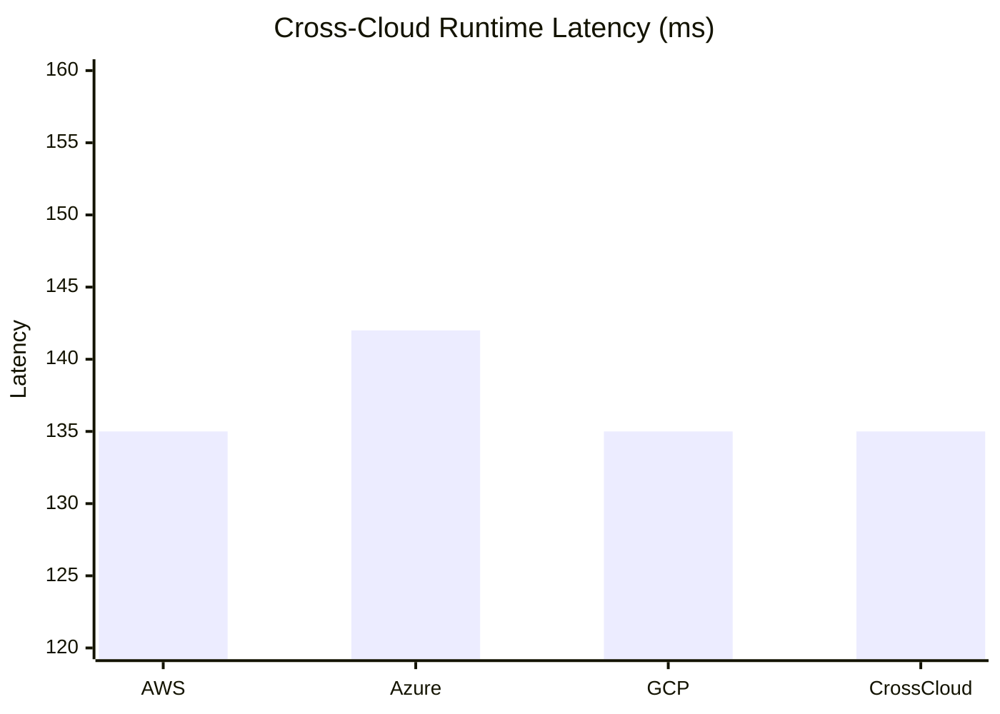
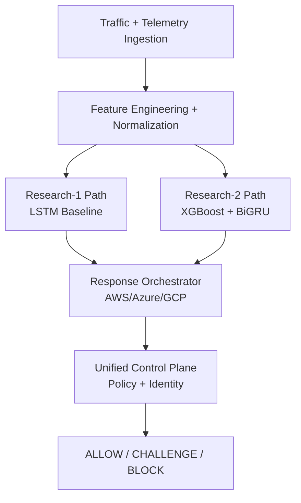
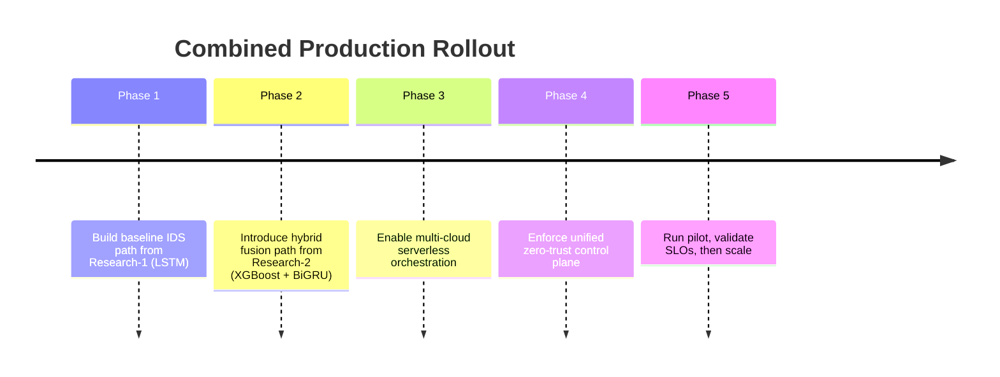

# Serverless Intelligent Firewall Research-2 (SIF-CCA)

## Towards a Serverless Intelligent Firewall: Integrating Cross-Cloud Adaptation, AI-Driven Security, and Zero-Trust Architectures

[](https://anis151993.github.io/Serverless-Intelligent-Firewall-Research-2/)
[](https://anis151993.github.io/Serverless-Intelligent-Firewall-Research-1/)
[](https://cloud-conf.net/smartcloud/2026/index.html)

This repository is the second research artifact in the **Serverless Intelligent Firewall** series.  
It extends Research-1 into a practical multi-cloud model with:

- hybrid XGBoost + BiGRU detection
- cross-cloud serverless orchestration (AWS, Azure, GCP)
- unified zero-trust control plane
- graph-rich interactive website and implementation guidance

## Live Research Portal

- Main portal: <https://anis151993.github.io/Serverless-Intelligent-Firewall-Research-2/>
- HTML report: <https://anis151993.github.io/Serverless-Intelligent-Firewall-Research-2/report.html>
- Poster: <https://anis151993.github.io/Serverless-Intelligent-Firewall-Research-2/poster.html>
- Combined implementation guide: <https://anis151993.github.io/Serverless-Intelligent-Firewall-Research-2/implementation.html>

---

## Research-1 to Research-2 Linkage



| Dimension | Research-1 | Research-2 |
|---|---|---|
| Core model | LSTM | XGBoost + BiGRU fusion |
| Scope | IDS in serverless context | IDS + multi-cloud orchestration + UCP |
| Cloud model | Early single-cloud orientation | AWS + Azure + GCP |
| Zero-trust | Conceptual integration | Unified control plane with consistency metrics |
| Portal maturity | Website + report + poster | Expanded analytics + implementation blueprint |

---

## Key Results (Graphical)







---

## Interactive Architecture (Graphical)



The website also includes an **interactive architecture explorer** (`/docs/index.html`) where each phase can be selected to view operational details.

---

## Real-Time Implementation Guidance (Combined Documentation)

The implementation documentation combines both research phases and is available at:

- Web version: [`docs/implementation.html`](docs/implementation.html)
- Repository reference: [`IMPLEMENTATION_GUIDE.md`](IMPLEMENTATION_GUIDE.md)

Implementation progression:



---

## Repository Structure

```text
.
├── docs/
│   ├── index.html                 # Main portal (interactive charts + architecture explorer)
│   ├── report.html                # Public report with extended analytics
│   ├── poster.html                # Poster-style overview
│   ├── implementation.html        # Combined real-time implementation guide
│   ├── styles.css
│   ├── script.js
│   └── assets/
│       ├── images/
│       └── papers/                # Encrypted archives only
├── scripts/
│   └── check-js.sh                # Local JavaScript syntax checker
├── IMPLEMENTATION_GUIDE.md
└── README.md
```

---

## Protected Artifacts Policy

Raw manuscript files are intentionally not published in plaintext.  
Public distribution uses encrypted archives only:

- `docs/assets/papers/SIF-CCA-Research-Paper-Encrypted.zip`
- `docs/assets/papers/SIF-CCA-LaTeX-Source-Encrypted.zip`

Access policy:

1. Follow GitHub profile: <https://github.com/ANIS151993>
2. Subscribe to overview video/channel: <https://youtu.be/O_pLEz7cyaY>
3. Send password request to: `engr.aanis@gmail.com`
4. Enter password in website gate before download

---

## Deployment

Use GitHub Pages branch deployment:

1. Repository Settings -> Pages
2. Source: `Deploy from a branch`
3. Branch: `main`
4. Folder: `/docs`

---

## Local JavaScript Syntax Check

Run one command from the repository root:

```bash
bash scripts/check-js.sh
```

Optional custom Node binary:

```bash
NODE_BIN=/absolute/path/to/node bash scripts/check-js.sh
```

---

## Primary Links

- Research-1 website: <https://anis151993.github.io/Serverless-Intelligent-Firewall-Research-1/>
- Research-1 repository: <https://github.com/ANIS151993/Serverless-Intelligent-Firewall-Research-1>
- Research-2 website: <https://anis151993.github.io/Serverless-Intelligent-Firewall-Research-2/>
